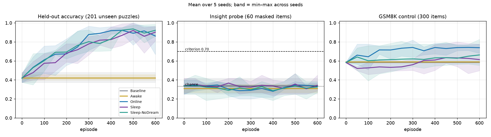
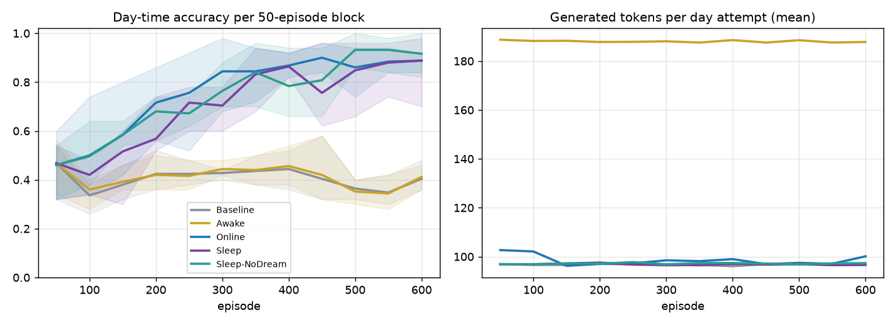
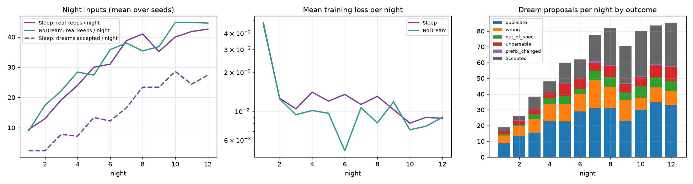
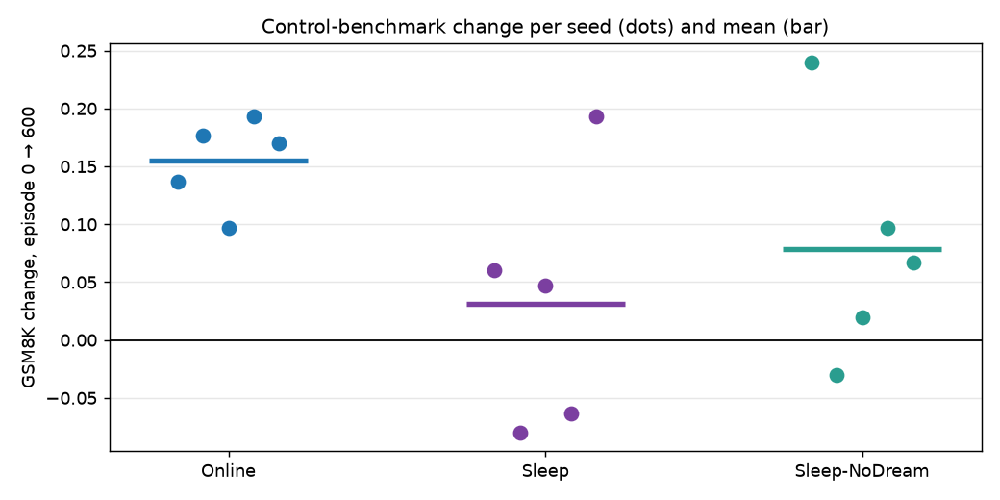

# doze-llm — deep exploratory analysis of the completed 4B grid

Seeds [0, 1, 2, 3, 4]; all five arms per seed. Everything below is descriptive or exploratory and was **not** preregistered; the preregistered verdicts are in `analysis_final.md`. Figures in `figures/`.

## 1. Insight probe, pooled

Pooling every probe item over seeds and checkpoints gives far more power than any single checkpoint (≈3,900 item-evaluations per trained arm; 300 per frozen arm, whose 13 checkpoints repeat one identical evaluation). The same 60 items are re-asked at every checkpoint, so the pooled CI for trained arms is optimistic; the final-checkpoint column (300 independent items per arm) is the conservative reading. A shortcut used even 5% of the time would show in either.

| arm | all checkpoints: correct / n | rate | 95% CI | p vs 1/3 | final checkpoint rate (n) | best single checkpoint |
|---|---|---|---|---|---|---|
| Baseline | 102 / 300 | 0.340 | 0.289–0.395 | 0.849 | 0.340 (300) | 0.42 (seed 1, ep 600) |
| Awake | 93 / 300 | 0.310 | 0.260–0.364 | 0.427 | 0.310 (300) | 0.35 (seed 1, ep 600) |
| Online | 1251 / 3900 | 0.321 | 0.306–0.336 | 0.099 | 0.333 (300) | 0.40 (seed 1, ep 50) |
| Sleep | 1311 / 3900 | 0.336 | 0.321–0.351 | 0.720 | 0.343 (300) | 0.47 (seed 1, ep 500) |
| Sleep-NoDream | 1240 / 3900 | 0.318 | 0.304–0.333 | 0.043 | 0.327 (300) | 0.47 (seed 1, ep 500) |

## 2. Learning during the day

Accuracy of the model's own day-time attempts per 50-episode block (these are the attempts that feed the filters), and how long a typical attempt is.

| arm | block 1 acc | block 6 acc | block 12 acc | tokens/attempt block 1 → 12 | correct steps/attempt block 1 → 12 |
|---|---|---|---|---|---|
| Baseline | 0.468 | 0.428 | 0.404 | 97 → 97 | 6.6 → 6.4 |
| Awake | 0.468 | 0.444 | 0.412 | 189 → 188 | 6.4 → 6.4 |
| Online | 0.460 | 0.844 | 0.888 | 103 → 100 | 6.8 → 9.9 |
| Sleep | 0.468 | 0.704 | 0.888 | 97 → 97 | 6.6 → 10.1 |
| Sleep-NoDream | 0.460 | 0.764 | 0.916 | 97 → 97 | 6.5 → 10.3 |

Where wrong attempts fail (number of correct leading steps before the first error; pooled over 5 seeds, so 500 attempts per column):

| arm | wrong in first 100 episodes | mode of first-error step | wrong in last 100 | mode of first-error step |
|---|---|---|---|---|
| Baseline | 299 | 5 | 312 | 6 |
| Awake | 293 | 6 | 311 | 6 |
| Online | 260 | 6 | 57 | 8 |
| Sleep | 278 | 6 | 58 | 6 |
| Sleep-NoDream | 261 | 5 | 38 | 7 |

## 3. Held-out items: what the model actually wrote

Recomputed from the saved per-item rows (model's parsed steps and answer) at the final checkpoint; `reported` is the harness's own number, as a consistency check.

| run | recomputed correct / n | reported |
|---|---|---|
| awake_seed1 | 91 / 201 = 0.453 | 0.453 |
| awake_seed2 | 82 / 201 = 0.408 | 0.408 |
| awake_seed3 | 87 / 201 = 0.433 | 0.433 |
| awake_seed4 | 80 / 201 = 0.398 | 0.398 |
| baseline_seed0 | 75 / 201 = 0.373 | 0.373 |
| baseline_seed1 | 96 / 201 = 0.478 | 0.478 |
| baseline_seed2 | 86 / 201 = 0.428 | 0.428 |
| baseline_seed3 | 86 / 201 = 0.428 | 0.428 |
| baseline_seed4 | 80 / 201 = 0.398 | 0.398 |
| online_seed1 | 181 / 201 = 0.900 | 0.900 |
| online_seed2 | 172 / 201 = 0.856 | 0.856 |
| online_seed3 | 193 / 201 = 0.960 | 0.960 |
| online_seed4 | 186 / 201 = 0.925 | 0.925 |
| sleep_nodream_seed0 | 195 / 201 = 0.970 | 0.970 |
| sleep_nodream_seed1 | 178 / 201 = 0.886 | 0.886 |
| sleep_nodream_seed2 | 173 / 201 = 0.861 | 0.861 |
| sleep_nodream_seed3 | 182 / 201 = 0.905 | 0.905 |
| sleep_nodream_seed4 | 198 / 201 = 0.985 | 0.985 |
| sleep_seed1 | 163 / 201 = 0.811 | 0.811 |
| sleep_seed2 | 187 / 201 = 0.930 | 0.930 |
| sleep_seed3 | 176 / 201 = 0.876 | 0.876 |
| sleep_seed4 | 194 / 201 = 0.965 | 0.965 |

First wrong step on held-out items (count of wrong items by number of correct leading steps), first vs final evaluation:

| arm | first eval | final eval |
|---|---|---|
| Baseline | {1: 27, 2: 54, 3: 93, 4: 109, 5: 80, 6: 85, 7: 31, 8: 82, 10: 21} | {1: 27, 2: 54, 3: 93, 4: 109, 5: 80, 6: 85, 7: 31, 8: 82, 10: 21} |
| Awake | {1: 18, 2: 38, 3: 77, 4: 98, 5: 70, 6: 58, 7: 24, 8: 64, 9: 1, 10: 16} | {1: 18, 2: 38, 3: 77, 4: 98, 5: 70, 6: 58, 7: 24, 8: 64, 9: 1, 10: 16} |
| Online | {1: 20, 2: 36, 3: 77, 4: 88, 5: 67, 6: 63, 7: 24, 8: 66, 10: 18} | {1: 1, 2: 6, 3: 12, 4: 11, 5: 11, 6: 11, 7: 13, 8: 2, 9: 1, 10: 4} |
| Sleep | {1: 20, 2: 37, 3: 77, 4: 85, 5: 64, 6: 63, 7: 25, 8: 68, 10: 17} | {3: 2, 4: 24, 5: 9, 6: 14, 7: 11, 8: 20, 9: 2, 10: 2} |
| Sleep-NoDream | {1: 27, 2: 53, 3: 93, 4: 112, 5: 83, 6: 85, 7: 30, 8: 80, 10: 22} | {2: 4, 3: 8, 4: 10, 5: 16, 6: 17, 7: 7, 8: 16, 9: 1} |

Held-out items never solved by any trained arm at episode 600 (pooled over seeds, items seen ≥3 times): **3** of 978. Examples: [('491194144944', 3, 3), ('499194999499', 3, 3), ('949494111411', 3, 3)]

## 4. Control benchmark dynamics

| arm | mean change per checkpoint | SD | worst single change per seed | checkpoints with a drop ≥ 0.05 (of n) |
|---|---|---|---|---|
| Online | +0.0129 | 0.064 | [-0.087, -0.03, -0.153, -0.023, -0.207] | 5 (of 60) |
| Sleep | +0.0026 | 0.053 | [-0.06, -0.083, -0.087, -0.08, -0.047] | 8 (of 60) |
| Sleep-NoDream | +0.0066 | 0.046 | [-0.033, -0.07, -0.047, -0.11, -0.037] | 5 (of 60) |

| arm | seed | GSM8K Δ | peak | trough | max drawdown | volatility |
|---|---|---|---|---|---|---|
| Online | 0 | +0.137 | 0.723 | 0.587 | 0.090 | 0.040 |
| Online | 1 | +0.177 | 0.787 | 0.580 | 0.030 | 0.043 |
| Online | 2 | +0.097 | 0.820 | 0.563 | 0.153 | 0.065 |
| Online | 3 | +0.193 | 0.777 | 0.583 | 0.040 | 0.056 |
| Online | 4 | +0.170 | 0.777 | 0.507 | 0.207 | 0.097 |
| Sleep | 0 | +0.060 | 0.687 | 0.477 | 0.110 | 0.062 |
| Sleep | 1 | -0.080 | 0.587 | 0.457 | 0.120 | 0.048 |
| Sleep | 2 | +0.047 | 0.640 | 0.497 | 0.087 | 0.047 |
| Sleep | 3 | -0.063 | 0.633 | 0.473 | 0.113 | 0.048 |
| Sleep | 4 | +0.193 | 0.800 | 0.513 | 0.070 | 0.055 |
| Sleep-NoDream | 0 | +0.240 | 0.827 | 0.587 | 0.043 | 0.046 |
| Sleep-NoDream | 1 | -0.030 | 0.620 | 0.533 | 0.070 | 0.050 |
| Sleep-NoDream | 2 | +0.020 | 0.660 | 0.530 | 0.130 | 0.034 |
| Sleep-NoDream | 3 | +0.097 | 0.680 | 0.390 | 0.193 | 0.052 |
| Sleep-NoDream | 4 | +0.067 | 0.707 | 0.583 | 0.093 | 0.043 |

Sleep: Pearson correlation between the GSM8K change across a night and that night's training (n = 60 nights): loss -0.269, buffer size 0.089, train-set size 0.214, dream fraction of the train set -0.094, new keeps 0.217. Values near 0 mean the forgetting is not explained by that quantity.

## 5. Nights

Mean over seeds per night (Sleep). `kept` = day trajectories passing the C3 filter (real keeps added to the buffer); `new` = items new to this night's train set = real keeps + accepted dreams; the train set is `new` plus a 1:1 replay draw.

| night | kept | new | buffer | dreams gen. | accepted | yield | dup | wrong | out-of-spec | unparsable | structured frac | loss | seconds |
|---|---|---|---|---|---|---|---|---|---|---|---|---|---|
| 1 | 9.4 | 11.8 | 9 | 18.8 | 2.4 | 0.14 | 8.8 | 4.8 | 1.0 | 1.8 | 0.250 | 0.0468 | 66 |
| 2 | 13.0 | 15.4 | 22 | 26.0 | 2.4 | 0.11 | 13.4 | 6.2 | 0.8 | 2.8 | 0.067 | 0.0126 | 78 |
| 3 | 19.2 | 27.0 | 42 | 38.4 | 7.8 | 0.19 | 15.4 | 8.6 | 3.2 | 3.4 | 0.100 | 0.0104 | 102 |
| 4 | 24.0 | 31.2 | 66 | 48.0 | 7.2 | 0.15 | 22.8 | 10.8 | 3.6 | 3.6 | 0.033 | 0.0140 | 99 |
| 5 | 30.0 | 43.4 | 96 | 60.0 | 13.4 | 0.22 | 22.6 | 11.0 | 5.0 | 7.8 | 0.077 | 0.0119 | 117 |
| 6 | 31.0 | 43.2 | 127 | 62.0 | 12.2 | 0.19 | 29.0 | 11.2 | 3.2 | 6.4 | 0.180 | 0.0134 | 115 |
| 7 | 38.8 | 55.4 | 165 | 77.6 | 16.6 | 0.22 | 31.0 | 17.8 | 6.0 | 4.8 | 0.089 | 0.0113 | 139 |
| 8 | 41.0 | 64.4 | 206 | 82.0 | 23.4 | 0.29 | 31.2 | 13.4 | 6.2 | 7.2 | 0.083 | 0.0130 | 145 |
| 9 | 35.2 | 58.6 | 242 | 70.4 | 23.4 | 0.32 | 22.8 | 13.6 | 4.6 | 5.4 | 0.081 | 0.0103 | 138 |
| 10 | 40.0 | 68.6 | 282 | 80.0 | 28.6 | 0.35 | 30.0 | 7.8 | 7.2 | 5.8 | 0.042 | 0.0081 | 150 |
| 11 | 41.8 | 66.2 | 323 | 83.6 | 24.4 | 0.29 | 34.8 | 9.4 | 6.4 | 7.6 | 0.096 | 0.0089 | 146 |
| 12 | 42.6 | 70.0 | 366 | 85.2 | 27.4 | 0.32 | 33.0 | 9.0 | 6.0 | 9.2 | 0.130 | 0.0088 | 147 |

Sleep-NoDream nights (mean over seeds):

| night | kept | new | buffer | train set | loss | seconds |
|---|---|---|---|---|---|---|
| 1 | 9.0 | 9.0 | 9 | 9 | 0.0483 | 52 |
| 2 | 17.4 | 17.4 | 26 | 26 | 0.0124 | 52 |
| 3 | 22.2 | 22.2 | 49 | 44 | 0.0094 | 52 |
| 4 | 28.4 | 28.4 | 77 | 57 | 0.0101 | 52 |
| 5 | 27.4 | 27.4 | 104 | 55 | 0.0096 | 52 |
| 6 | 35.8 | 35.8 | 140 | 72 | 0.0049 | 52 |
| 7 | 38.0 | 38.0 | 178 | 76 | 0.0106 | 52 |
| 8 | 35.4 | 35.4 | 214 | 71 | 0.0081 | 52 |
| 9 | 36.8 | 36.8 | 250 | 74 | 0.0118 | 52 |
| 10 | 44.8 | 44.8 | 295 | 90 | 0.0072 | 52 |
| 11 | 44.8 | 44.8 | 340 | 90 | 0.0076 | 52 |
| 12 | 44.6 | 44.6 | 385 | 89 | 0.0090 | 52 |

## 6. Stability of the task metric

| arm | mean max drawdown (held-out) | mean volatility | mean final − peak | first checkpoint ≥ 0.80 per seed |
|---|---|---|---|---|
| Baseline | 0.000 | 0.000 | 0.000 | [None, None, None, None, None] |
| Awake | 0.000 | 0.000 | 0.000 | [None, None, None, None, None] |
| Online | 0.181 | 0.104 | -0.101 | [300, 400, 300, 200, 250] |
| Sleep | 0.107 | 0.088 | -0.035 | [350, 400, 300, 350, 300] |
| Sleep-NoDream | 0.092 | 0.078 | -0.029 | [350, 400, 300, 450, 200] |

## 7. Secondary metrics (pooled)

| arm | mirror bias (pooled, n) | its chance level | late-step error rate (final) | early-step error rate (final) | short-answer gap (final) | median tokens per correct answer first → final | GSM8K unparsable max |
|---|---|---|---|---|---|---|---|
| Baseline | 0.338 (12610) | 0.337 | 0.470 | 0.410 | 0.035 | 98 → 98 | 0.000 |
| Awake | 0.332 (10374) | 0.329 | 0.457 | 0.411 | 0.054 | 216 → 216 | 0.000 |
| Online | 0.324 (4639) | 0.339 | 0.023 | 0.051 | 0.010 | 98 → 98 | 0.000 |
| Sleep | 0.304 (5905) | 0.330 | 0.050 | 0.044 | 0.056 | 98 → 98 | 0.000 |
| Sleep-NoDream | 0.319 (6758) | 0.337 | 0.038 | 0.040 | 0.060 | 98 → 98 | 0.000 |

## 8. Replay buffers at the end of training

From the saved buffer state (seeds with a recovered `.state`). Coverage = fraction of the 801 training prefixes present.

| buffer | items | distinct puzzles | train coverage | train-prefix coverage | outside train | touches held-out/probe | answer dist (train) |
|---|---|---|---|---|---|---|---|
| sleep_seed1 | 321 | 321 | 0.40 | 0.46 | 0 | 0 | 1:0.34, 4:0.34, 9:0.32 (1:0.33, 4:0.33, 9:0.33) |
| sleep_nodream_seed1 | 362 | 362 | 0.45 | 0.51 | 0 | 0 | 1:0.34, 4:0.34, 9:0.32 (1:0.33, 4:0.33, 9:0.33) |
| sleep_seed2 | 410 | 410 | 0.51 | 0.56 | 0 | 0 | 1:0.36, 4:0.31, 9:0.33 (1:0.33, 4:0.33, 9:0.33) |
| sleep_nodream_seed2 | 387 | 387 | 0.48 | 0.53 | 0 | 0 | 1:0.34, 4:0.31, 9:0.35 (1:0.33, 4:0.33, 9:0.33) |
| sleep_seed3 | 347 | 347 | 0.43 | 0.48 | 0 | 0 | 1:0.28, 4:0.35, 9:0.37 (1:0.33, 4:0.33, 9:0.33) |
| sleep_nodream_seed3 | 336 | 336 | 0.42 | 0.46 | 0 | 0 | 1:0.29, 4:0.35, 9:0.36 (1:0.33, 4:0.33, 9:0.33) |
| sleep_seed4 | 395 | 395 | 0.49 | 0.55 | 0 | 0 | 1:0.33, 4:0.34, 9:0.33 (1:0.33, 4:0.33, 9:0.33) |
| sleep_nodream_seed4 | 454 | 454 | 0.57 | 0.61 | 0 | 0 | 1:0.35, 4:0.33, 9:0.32 (1:0.33, 4:0.33, 9:0.33) |

## 9. Awake: did critique rounds do anything?

Rounds used per day attempt: {1: 436, 2: 2295, 3: 269}. Accuracy by rounds used: {1: 0.399, 2: 0.412, 3: 0.416}. Awake day accuracy 0.410 vs Baseline day accuracy 0.405.

## 10. Compute and time

| arm | generated tokens (mean) | gradient steps | training tokens | wall hours (mean, n) | GPUs |
|---|---|---|---|---|---|
| Baseline | 58008 | 0 | 0 | 4.5 (4) | {'NVIDIA L4': 1, 'NVIDIA A16-16Q': 3} |
| Awake | 112828 | 0 | 0 | 17.8 (4) | {'NVIDIA A16-16Q': 4} |
| Online | 59119 | 592 | 57848 | 8.7 (4) | {'NVIDIA A16-16Q': 4} |
| Sleep | 112757 | 600 | 58022 | 7.7 (4) | {'NVIDIA L4': 1, 'NVIDIA A16-16Q': 3} |
| Sleep-NoDream | 58300 | 600 | 58203 | 8.5 (4) | {'NVIDIA A16-16Q': 4} |

## 11. Power

H4 paired differences (Sleep − Online GSM8K Δ): [-0.077, -0.257, -0.05, -0.257, 0.023], mean -0.123, SD 0.127. With n = 5 the exact sign-flip test cannot go below p = 0.0625. At the observed effect and spread, a paired test would need roughly n ≈ 9 seeds for 80% power.
